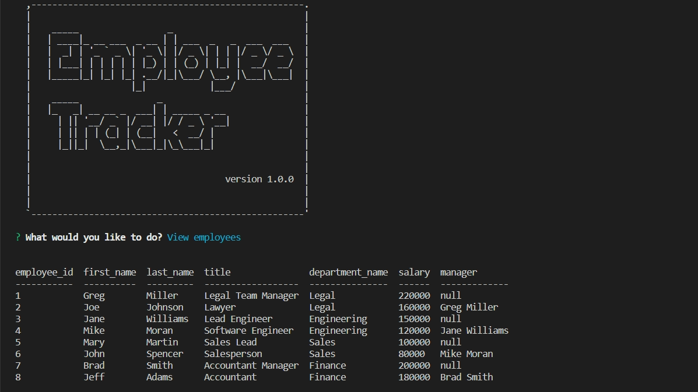

# Employee Tracker

## Table-of-Contents

- [Description](#description)
- [Installation](#installation)
- [Usage](#usage)
- [Contributing](#contributing)
- [Tests](#tests)
- [License](#license)
- [Questions](#questions)

## [Description](#table-of-contents)

This is an application utilizing Node.js, MySQL and Inquirer, which allows users to manage their employee and company information in a database.

## [Installation](#table-of-contents)

A user must clone this repository and make sure they have installed Node.js on their computer. Once cloned and installed, the user will be required to install the MySQL2, Inquirer, console.table and aciiart-logo modules by typing `npm install` in their terminal. Users will also be required to log into MySQL from the command line, preferably in a second terminal window using `mysql -u root -p` and typing in password immidately after. Finally, the user will `drop`, `create` and `use` the `employee_db`.

## [Usage](#table-of-contents)

From the command line in the terminal, a user can type `node server` to open the Employee Tracker and begin the user prompts.

### **Click on the following link to view the video demonstration:**
https://drive.google.com/file/d/1KAqHKymfHmf8MKy6RXkPXNnTEwFfO8bU/view

### **Screenshot of the Employee Tracker from the Command Line:**

## [Contributing](#table-of-contents)

Contributors can see installation instructions or contact me with the information below.

## [Tests](#table-of-contents)

There are no tests for this application.

## [License](#table-of-contents)

## [Questions](#table-of-contents)

If you have any questions about this project, please contact me using the following links:

[GitHub](https://github.com/Gregm316)

[Email: gregm316@gmail.com](mailto:gregm316@gmail.com)
